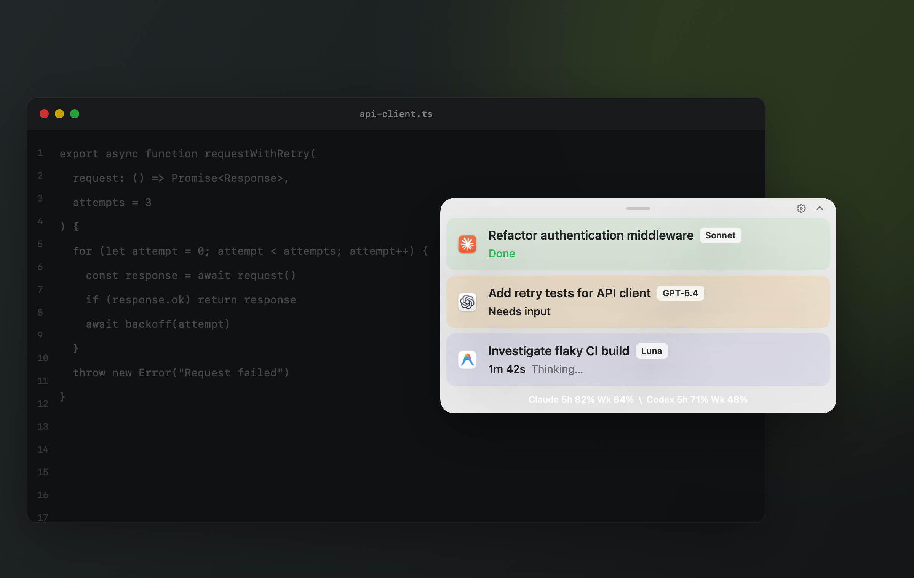

<p align="center">
  <picture>
    <source srcset="docs/assets/agentpip-logo-dark.png" media="(prefers-color-scheme: dark)">
    <source srcset="docs/assets/agentpip-logo-light.png" media="(prefers-color-scheme: light)">
    
  </picture>
</p>

<p align="center">Keep an eye on every coding agent without leaving your work.</p>

<p align="center">
  <a href="https://github.com/axcdeng/AgentPiP/releases/latest"></a>
  
  
</p>

<p align="center">
  <a href="README.md">English</a> | <a href="README.zh-CN.md">简体中文</a><br>
  <a href="https://github.com/axcdeng/AgentPiP/releases/latest"></a>
</p>

---

### Installation

Download `AgentPiP-1.1.1.dmg` from the [latest release](https://github.com/axcdeng/AgentPiP/releases/latest), open it, and drag `AgentPiP.app` into Applications.

AgentPiP 1.1.1 is currently unsigned. The first time you open it, macOS may block the app. Open **System Settings → Privacy & Security**, find the AgentPiP message, then click **Open Anyway**.

### What it does

AgentPiP is a small, native macOS picture-in-picture monitor for active coding-agent sessions. It stays out of the way while showing the details that matter:

- Live **working**, **needs input**, **done**, **stopped**, and **error** states
- Current activity such as thinking, editing, searching, and running commands
- One-click return to the original agent thread
- Collapsible floating panel with light and dark appearances
- Optional usage-limit summaries for Claude and Codex
- Controls to hide, restore, dismiss, or pause monitored sessions

### Supported agents

| Agent | Session status | Usage limits |
| --- | :---: | :---: |
| Claude | ✓ | Optional |
| Codex / ChatGPT | ✓ | ✓ |
| Google Antigravity | ✓ | — |
| OpenCode | ✓ | — |
| Cursor | ✓ | — |

AgentPiP only shows providers it can detect locally. No extra accounts or services are required.

### Privacy

AgentPiP reads local agent event metadata from your Mac. It does not inspect ordinary chats, upload session contents, or require a cloud account of its own.

> [!IMPORTANT]
> **Claude limits are completely optional.** You do not need to provide a Claude `sessionKey` to use AgentPiP. Claude session monitoring works without it; the key is only used if you explicitly enable the Claude usage-limit footer.

If you choose to enable Claude limits, the value is stored in an AgentPiP-owned macOS Keychain item and sent only to Claude.ai over HTTPS to request usage information. It is never stored in `UserDefaults` or written to logs. You can remove it at any time in AgentPiP Settings.

Codex limits are read from local Codex usage events and do not require credentials.

### Build from source

Requires macOS 14 or newer, Xcode 16 or newer, and Swift 6.

```bash
git clone https://github.com/axcdeng/AgentPiP.git
cd AgentPiP
swift test
./scripts/build-app.sh
open .build/AgentPiP.app
```

For development, you can also run the executable directly:

```bash
swift run AgentPiP
```

### How it works

AgentPiP watches the local session data already maintained by supported coding tools, using read-only filesystem and SQLite access. Provider formats are not public contracts, so its parsers are deliberately defensive and may require updates when those apps change.

The app is built with SwiftUI and AppKit. It has no analytics, advertising, or background account service.

---

<p align="center">Built for people who would rather watch the work than babysit the window.</p>
