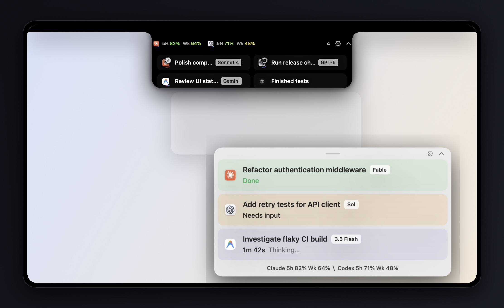

<p align="center">
  <picture>
    <source srcset="docs/assets/agentpip-logo-dark.png" media="(prefers-color-scheme: dark)">
    <source srcset="docs/assets/agentpip-logo-light.png" media="(prefers-color-scheme: light)">
    
  </picture>
</p>

<p align="center">无需离开当前工作，即可随时掌握每个编程智能体的状态。</p>

<p align="center">
  <a href="https://github.com/axcdeng/AgentPiP/releases/latest"></a>
  
  
</p>

<p align="center">
  <a href="README.md">English</a> | <a href="README.zh-CN.md">简体中文</a><br>
  <a href="https://github.com/axcdeng/AgentPiP/releases/latest"></a>
</p>

---

### 安装

从[最新版本](https://github.com/axcdeng/AgentPiP/releases/latest)下载 `AgentPiP-2.0.zip`，解压后将 `AgentPiP.app` 移入“应用程序”文件夹。

AgentPiP 2.0 尚未经过公证。首次打开时，macOS 可能会阻止应用运行。请打开**系统设置 → 隐私与安全性**，找到有关 AgentPiP 的提示，然后点击**仍要打开**。

### 紧凑刘海模式

AgentPiP 2.0 可以直接显示在 MacBook 刘海周围。紧凑模式为每个活跃智能体显示一个图标：运行命令时显示终端徽标，编辑文件时显示铅笔徽标。悬停即可展开双栏会话网格。

### 功能

AgentPiP 是一款轻巧的原生 macOS 画中画工具，用于监控正在运行的编程智能体会话。它不会打断你的工作，只显示真正重要的信息：

- 实时显示**工作中**、**需要输入**、**已完成**、**已停止**和**错误**状态
- 显示思考、编辑、搜索和运行命令等当前活动
- 提供紧凑和详细两种刘海布局，并通过徽标快速提示编辑和命令活动
- 无需离开刘海界面即可回答受支持的智能体问题
- 一键返回原智能体会话
- 支持折叠的悬浮面板，以及浅色和深色外观
- 可选显示 Claude 和 Codex 使用限额
- 支持隐藏、恢复、关闭会话或暂停监控

### 支持的智能体

| 智能体 | 会话状态 | 使用限额 |
| --- | :---: | :---: |
| Claude | ✓ | 可选 |
| Codex / ChatGPT | ✓ | ✓ |
| Google Antigravity | ✓ | — |
| OpenCode | ✓ | — |
| Cursor | ✓ | — |

AgentPiP 只会显示能够在本机检测到的提供方，无需额外账户或服务。

### 隐私

AgentPiP 只读取 Mac 上的本地智能体事件元数据，不会查看普通聊天内容、上传会话内容，也不需要自己的云端账户。

> [!IMPORTANT]
> **Claude 使用限额完全是可选功能。** 使用 AgentPiP 不需要提供 Claude `sessionKey`。即使没有该密钥，Claude 会话监控也能正常工作；只有在你主动启用 Claude 限额显示时才需要提供。

如果你选择启用 Claude 限额，该值会存储在 AgentPiP 专属的 macOS 钥匙串项目中，并且只通过 HTTPS 发送至 Claude.ai 以获取使用信息。它不会存储在 `UserDefaults` 中，也不会写入日志。你可以随时在 AgentPiP 设置中将其删除。

Codex 限额直接从本地 Codex 使用事件中读取，无需任何凭据。

### 从源代码构建

需要 macOS 14 或更高版本、Xcode 16 或更高版本以及 Swift 6。

```bash
git clone https://github.com/axcdeng/AgentPiP.git
cd AgentPiP
swift test
./scripts/build-app.sh
open .build/AgentPiP.app
```

开发时也可以直接运行可执行文件：

```bash
swift run AgentPiP
```

### 工作原理

AgentPiP 使用只读文件系统和 SQLite 访问，监控受支持编程工具已经保存在本机的会话数据。提供方的数据格式并非公开接口，因此解析器采用了防御性设计；当这些应用更新时，AgentPiP 也可能需要相应更新。

本应用使用 SwiftUI 和 AppKit 构建，不包含分析统计、广告或后台账户服务。

---

<p align="center">为那些更想关注成果，而不是时刻盯着窗口的人而打造。</p>
